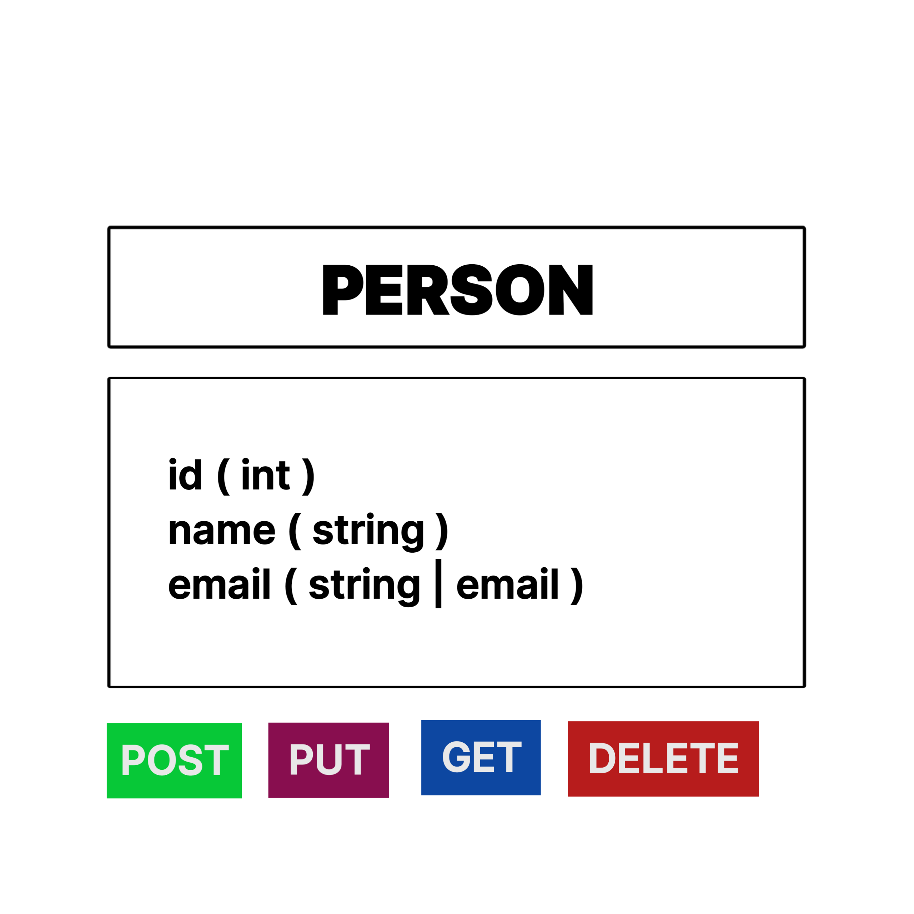

# HNGx CRUD Person REST API
This is a Django REST API project that allows you to manage and interact with a "Person"
resource. You can perform CRUD (Create, Read, Update, Delete) operations on individuals'
data.
## Table of Contents
- [Getting Started](#getting-started)
- [Prerequisites](#prerequisites)
- [Installation](#installation)
- [Usage](#usage)
- [API Endpoints](#api-endpoints)
- [Testing](#testing)
- [Deployment](#deployment)
- [Documentation](#documentation)
- [Contributing](#contributing)
- [License](#license)
## Getting Started

### Prerequisites
- [Python](https://www.python.org/downloads/) (3.10 or higher)
- [Django](https://www.djangoproject.com/) (3.0 or higher)
- [Django Rest Framework](https://www.django-rest-framework.org/)
- [Git](https://git-scm.com/)
### Installation
1. Clone the repository:
```bash
git clone https://github.com/yourusername/my-awesome-api.git
cd my-awesome-api
```
2. Create and activate a virtual environment:
```bash
python -m venv venv
source venv/bin/activate
```
3. Install dependencies:
```bash
pip install -r requirements.txt
```
4. Apply database migrations:
```bash
python manage.py migrate
```
5. Start the development server:
```bash
python manage.py runserver
```
Your API should now be running locally at `http://localhost:8000/`.
## Usage
To use the API, you can make HTTP requests to the provided endpoints. Here's an overview of
the available endpoints:
## API Endpoints
- `POST /api`: Create a new person.
- `GET /api/<user_id>`: Retrieve details of a person by their ID.
- `PUT /api/<user_id>`: Update details of an existing person.
- `DELETE /api/<user_id>`: Remove a person.
### Example Requests
- Create a new person:
```http
POST http://localhost:8000/api
Content-Type: application/json
{
"name": "John Doe",
"email": "john@example.com"
}
```
- Retrieve details of a person:
```http
GET http://localhost:8000/api/1
```
- Update details of a person:
```http
PUT http://localhost:8000/api/1
Content-Type: application/json
{
"name": "Updated John Doe",
"email": "updated_john@example.com"
}
```
- Remove a person:
```http
DELETE http://localhost:8000/api/1
```
## Testing
To run the test suite, use the following command:
```bash
python manage.py test
```

## Documentation
For detailed information on how to use this API, check the [API Documentation](DOCUMENTATION.md) file.